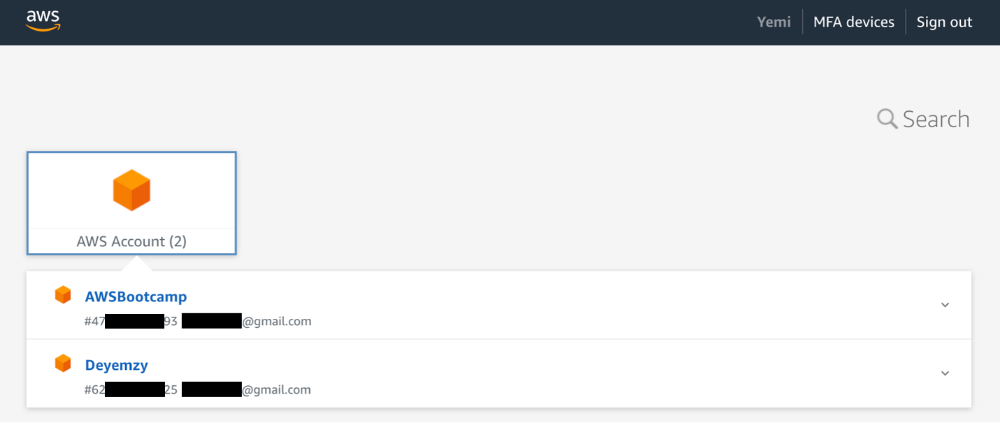
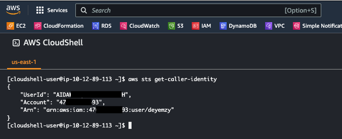

# Week 0 — Billing and Architecture

# Prequisites

Created new AWS Account for the Bootcamp. Added the account to AWS Organization and enabled AWS IAM Identity Center (successor to AWS Single sign on)




Created Github repo.

Created Gitpod account and integrated it with Github. Used Gifted Lane's Video for setup, and Andrew Brown's video for the Gitpod extension.

Created Lucidchart account using Gifted Lane’s video.

Created Honeycomb.io account using Gifted Lane’s video.

Created Rollbar account using Gifted Lane’s video.


# Required work

## 1. Watch Week zero video

Attended the live stream from A-Z, but I rewatched some parts that were not so clear to me. Watched Chirag’s video on Spend consideration and Ashish’s video on Security consideration.


### During Margaret’s session: **Project Management**.


**Microservices** and **monolithic** architectures are two common approaches to building complex software systems. In an AWS environment, there are several advantages to using a microservices architecture over a monolithic architecture:

**Agility**: Microservices can make it easier to develop, test, and deploy new features, because changes to one microservice can be made without affecting the rest of the application. This can enable faster time-to-market and more frequent releases.

**Flexible scaling**: Microservices allow for more granular scaling, which can be especially important in cloud environments like AWS where demand for resources can fluctuate rapidly. Because each microservice can be deployed and scaled independently, one can allocate resources only where they are needed, rather than scaling an entire monolithic application up or down.


**Technological freedom**: Microservices allow for more flexibility in choosing the best technology for each individual service, rather than being constrained by the technology choices made for the entire monolithic application.

**Easy deployment**: Microservices architecture makes deployment easy by enabling continuous integration and continuous delivery. This facilitates experimentation, allowing new ideas to be tried out and rolled back easily if they don't work. The low cost of failure also makes it easier to update code, while accelerating the time-to-market for new features.

**Team autonomy**: Because each microservice can be owned and managed by a separate team, microservices can enable greater team autonomy and ownership, which can lead to better alignment between technology and business goals.

**Resilience**: Microservices are designed to be more resilient to failures, because a failure in one microservice should not necessarily bring down the entire application. This is in contrast to monolithic architectures, where a single failure can take down the entire application.


**Separating business logic from the user interface** means creating two distinct layers in software development. The business logic layer contains the code that implements the application's core functionality, while the user interface layer is responsible for presenting the data and functionality to users. This separation enables more maintainable, scalable, and flexible software systems.


**Iron Triangles**


The Iron Triangle is a concept in project management that represents the three key constraints that project managers must balance in order to successfully deliver a project. These constraints are:

1. Time: the amount of time available to complete the project.
2. Cost: the budget or resources available to complete the project.
3. Scope: the goals, requirements, functionality and features of the project.

The Iron Triangle is so named because the three constraints are interdependent, meaning that changes to one constraint will impact the other two. For example, increasing the scope of a project may require more time and resources, which could increase the cost. Alternatively, reducing the budget or timeline of a project may require reducing the scope of the project.


### During Chris’ session: **Architecting your Cloud**

**RRAC**

**(R)** Good architecture must meet the following requirements:
* Verifiable
* Monitorable
* Traceable
* Feasible: e.g meet ISO standards, 99.9% uptime, user can do specific task.

**(R)** Risks can prevent the project from being successful (must be mitigated)
* Single Point of Failure (SPoFs): This can be a risk for uptime
* User commitment: Lack of Budgetary or executive commitment
* Late delivery: How fast can we deploy to prod.

**(A)** Assumptions are factors held as true for the planning and implementation phases:
* Sufficient network bandwidth.
* Stakeholders will be available to make decisions.
* Budget is approved

**(C)** Constraints are policy or technical limitations for the project:
* Time
* Budget
* Vendor selection


### Design
Once you have RRACs gathered, you can then create your design:

**Conceptual design**:
* Created by business stakeholder and architects
* Organizes and defines concepts and rules
* “Napkin design”: No technical aspect for the conceptual design.


**Logical design**: we can call it “The Blueprint”
* Defines how the system should be implemented
* Environment without actual names or sizes
* Example: undeployed CFT


**Physical design**: 
* Representation of the actual thing that was built
* IP addresses, EC2 instance ID, ARN etc

### AWS Well-Architected Framework
Use this to review your workload against current AWS best practices:
* Workload: Collection of resources and code that make up a cloud application
* Asks the right questions to hight blindspots
* Naturally falls into RRAC buckets
* Power tool in the architect’s toolbelt


The framework is organized around six key pillars, which are:
1.	Operational Excellence: This pillar focuses on ensuring that the system is able to operate and evolve efficiently, with a focus on reducing the time and effort required to perform operational tasks. This includes areas such as automating processes, using monitoring and logging tools, and maintaining documentation.

2.	Security: This pillar focuses on protecting the system from potential security threats and maintaining data privacy. This includes areas such as implementing least privilege access control, using encryption, and building in a defense-in-depth approach.

3.	Reliability: This pillar focuses on ensuring that the system can continue to operate even in the face of potential failures. This includes areas such as implementing fault tolerance, implementing disaster recovery plans, and testing the system to ensure that it is resilient to potential issues.

4.	Performance Efficiency: This pillar focuses on ensuring that the system is able to meet performance requirements while minimizing costs. This includes areas such as optimizing resource usage, implementing auto-scaling, and implementing caching mechanisms.

5.	Cost Optimization: This pillar focuses on optimizing costs while still meeting performance requirements. This includes areas such as using pay-as-you-go models, utilizing reserved instances, and rightsizing resources to match actual needs.

6.	Sustainability: This pillar focuses on addressing the long-term environmental, economic, and societal impact of business activities in the cloud.


## 2. Conceptual Diagram in Lucid Charts or on a Napkin
### C4 Model

The C4 model for visualising software architecture
* Context
* Containers
* Components
* Code


## 3. Recreated the Logical Architectual Diagram in Lucid Charts 


I placed the CDN in front of the load balancer to help improve the performance and availability of a web application by allowing the CDN to serve cached static content directly to users, reducing the load on the load balancer and the origin server. This can improve the response time and reduce the latency for users accessing the static content, resulting in a better user experience. Additionally, the CDN can provide additional security benefits, such as protection against DDoS attacks and other security threats, by filtering out malicious traffic before it reaches the load balancer or origin server.


## Created an Admin user, generated AWS Access Key pair and also used the AWS Cloudshell




Generated AWS Access Key/Secret pair for the cruddur-admin, which can be used to authenticate and access AWS resources programmatically. To enable persistent storage of these credentials for reuse, we added Gitpod variables and set them to the generated Access Key/Secret pair using the appropriate commands

```
gp env AWS_ACCESS_KEY_ID=""
gp env AWS_SECRET_ACCESS_KEY=""
gp env AWS_DEFAULT_REGION=""
```


## 4. Created budgets and billing alarms

Created separate budgets for credit and actual spend: Because having two budgets can help you more accurately forecast your future spending, as well as identify any areas where you may need to adjust your usage or optimize your resources to stay within budget. And I created the billing alarms to get notified when as estimated charges exceed the threshold.


