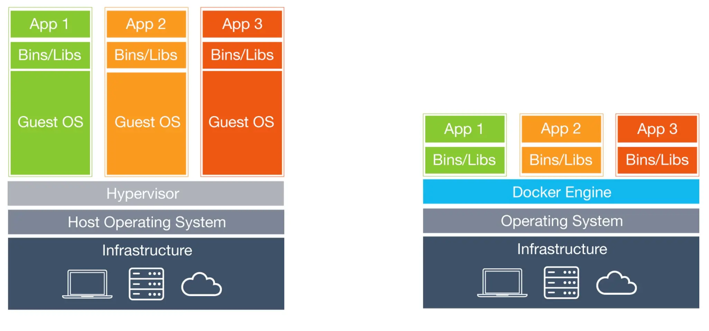
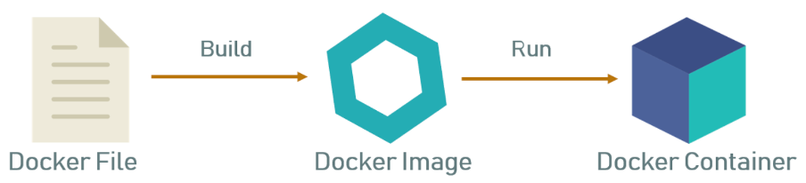
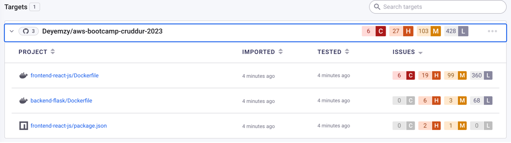

# Week 1 — App Containerization


[Source](https://images.idgesg.net/images/article/2017/06/virtualmachines-vs-containers-100727624-orig.jpg?auto=webp&quality=85,70)

## Containerized backend



#### Added a docker to the ```backend-flask/```
 
This Dockerfile sets up a container that can be used to run a Python Flask web application, with the necessary dependencies installed and the Flask development server running.

```
FROM python:3.10-slim-buster

WORKDIR /backend-flask

COPY requirements.txt requirements.txt

RUN pip3 install -r requirements.txt

COPY . .

ENV FLASK_ENV=development

EXPOSE ${PORT}

CMD [ "python3", "-m" , "flask", "run", "--host=0.0.0.0", "--port=4567"]
```


Breakdown:

*   ```FROM python:3.10-slim-buster```: This specifies the base image to use for the container, which is Python 3.10 on a slimmed-down version of the Debian Buster operating system.

* 	```WORKDIR /backend-flask```: This sets the working directory inside the container to /backend-flask.

* 	```COPY requirements.txt requirements.txt```: This copies the requirements.txt file from the host machine to the container's /backend-flask directory.

* 	```RUN pip3 install -r requirements.txt```: This runs the pip3 package manager to install the Python dependencies listed in requirements.txt inside the container.

* 	```COPY . .```: This copies the rest of the application files from the host machine to the container's /backend-flask directory.

* 	```ENV FLASK_ENV=development```: This sets the FLASK_ENV environment variable to "development", which is a configuration option for Flask that enables debugging and other development features.

* 	```EXPOSE ${PORT}```: This exposes the container's ${PORT} variable to the host machine, allowing traffic to be routed to the Flask application.

* 	```CMD [ "python3", "-m" , "flask", "run", "--host=0.0.0.0", "--port=4567"]```: This specifies the command to run when the container starts. In this case, it runs the Flask development server, which listens on all interfaces (--host=0.0.0.0) and the port specified by the ${PORT} environment variable (--port=4567).


#### Run Python flask web app (locally)

```
cd backend-flask
export FRONTEND_URL="*"
export BACKEND_URL="*"
python3 -m flask run --host=0.0.0.0 --port=4567
```
Steps:
* Make sure to unlock the port on the port tab

* Open the URL for port 4567 in your web browser.

* Add ```/api/activities/home``` to the end of the URL.

* You should receive a JSON response.
 

#### Build Container
To build a container image for the Flask web app.
```
docker build -t  backend-flask ./backend-flask
```
Breakdown:

* ```docker build```: This command initiates the building of a Docker image.

* ```-t backend-flask```: This sets the name of the Docker image to backend-flask.

* ```./backend-flask```: This specifies the build context for the Docker image, which is the backend-flask directory in the current working directory.


#### Run Container

```
docker run --rm -p 4567:4567 -it -e FRONTEND_URL='*' -e BACKEND_URL='*' backend-flask
```

This Docker command starts the container with the image backend-flask, maps the necessary ports and sets two environment variables, ```FRONTEND_URL``` and ```BACKEND_URL```, both to ```"*"``` to configure the app.

Breakdown:
*```docker run```: This command is used to start a new container from a Docker image.

* ```--rm```: This flag removes the container when it is stopped, which is useful for testing and development.
 
* ```-p 4567:4567```: This maps port 4567 from the container to port 4567 on the host.
 
* ```-it```: This flag allocates a pseudo-TTY and keeps stdin open, which allows you to interact with the container using the command line.
 
* ```-e FRONTEND_URL='*' -e BACKEND_URL='*'```: This sets the environment variables to ```"*"``` within the container.

* ```backend-flask```: This is the name of the Docker image that is used to create the new container.
 


## Containerized frontend
#### Run NPM Install
```
cd frontend-react-js
npm i
````

#### Create Docker File
Create the file here: ```frontend-react-js/Dockerfile```
```
FROM node:16.18

ENV PORT=3000

COPY . /frontend-react-js
WORKDIR /frontend-react-js
RUN npm install
EXPOSE ${PORT}
CMD ["npm", "start"]
```

This Dockerfile sets up a container environment with Node.js installed, copies the files for a React application into the container, installs the necessary dependencies, and specifies the command to run the application.

#### Build Container
```
docker build -t frontend-react-js ./frontend-react-js
```

#### Run Container
```
docker run -p 3000:3000 -d frontend-react-js
```


## Multiple containers
#### Create a docker-compose file
Create ```docker-compose.yml``` at the root of your project.
```
version: "3.8"
services:
  backend-flask:
    environment:
      FRONTEND_URL: "https://3000-${GITPOD_WORKSPACE_ID}.${GITPOD_WORKSPACE_CLUSTER_HOST}"
      BACKEND_URL: "https://4567-${GITPOD_WORKSPACE_ID}.${GITPOD_WORKSPACE_CLUSTER_HOST}"
    build: ./backend-flask
    ports:
      - "4567:4567"
    volumes:
      - ./backend-flask:/backend-flask
  frontend-react-js:
    environment:
      REACT_APP_BACKEND_URL: "https://4567-${GITPOD_WORKSPACE_ID}.${GITPOD_WORKSPACE_CLUSTER_HOST}"
    build: ./frontend-react-js
    ports:
      - "3000:3000"
    volumes:
      - ./frontend-react-js:/frontend-react-js

# the name flag is a hack to change the default prepend folder
# name when outputting the image names
networks: 
  internal-network:
    driver: bridge
    name: cruddur
```

This docker-compose.yml file defines a web application stack with two services, backend-flask and frontend-react-js, that communicate with each other over a network bridge. The services are built from Docker images defined in separate Dockerfiles, and the local directories for each service are mounted into the corresponding containers.


## Container Security

This is the practice of protecting your applications hosted on computer services like Containers. Common examples of applications can be Single Page Applications (SPAs), Microservices, APIs etc.

### Components and best practices.

**Docker and host configuration**:
 * Docker daemon & containers should run in non-root user mode
 * Use the latest version of Docker and apply security patches regularly.
 * Use a minimal operating system for the host.Disable all services that are not required.
 * Use firewalls to limit incoming and outgoing traffic.
 * Use container orchestration tools to manage containers and enforce security policies.

#### Securing images:
* Scan container images for vulnerabilities and malware.
* Verify image integrity and ensure images come from a trusted source.
* Remove unnecessary components and services from images.
* Use minimal and trusted base images.

#### Secret management:
* Use a secure secret store to manage secrets, such as Snyk, HashiCorp Vault, AWS Secrets Manager etc
* Use environment variables to inject secrets into containers at runtime.
* Store secrets in encrypted format.

#### Application security:
* Use secure coding practices to write secure applications.
* Use input validation and sanitization to prevent injection attacks.
* Implement role-based access control and authentication.
* Harden applications by configuring them to run in read-only mode, with minimal privileges.

#### Data security:
* Use encryption to protect sensitive data.
* Use access control mechanisms to ensure that only authorized users can access data.
* Backup and restore data regularly.
* Use secure communication channels to transmit data.

#### Monitoring and logging:
* Use logging frameworks to capture container logs and application events.
* Use monitoring tools to detect abnormal activity and security incidents.
* Analyze logs regularly to identify security incidents and system errors.

#### Compliance framework:
* Follow security guidelines and best practices, such as CIS Docker Benchmark or NIST Cybersecurity Framework.
* Use tools to automate compliance checks and audits.
* Document and review security policies and procedures regularly.


### Using [Snyk](https://snyk.io/)
A popular open-source security tool that is used to scan and identify vulnerabilities in software dependencies, including container images, package managers, and code repositories. 

I integrated Snyk with my public GitHub repository, which allowed for automatic vulnerability scanning and provided remediation advice for any identified security issues.


