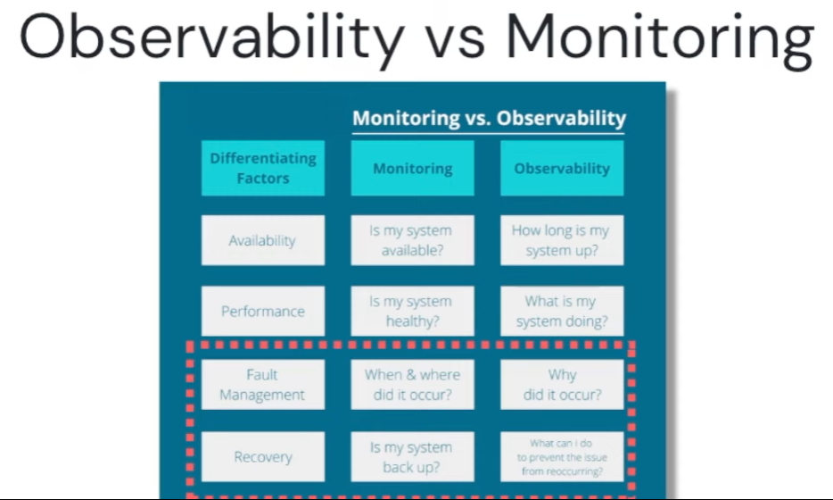
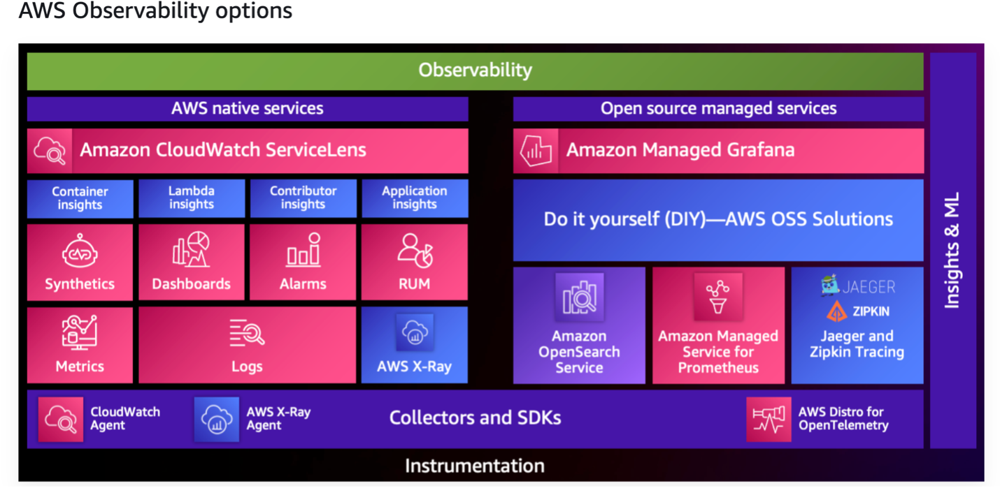
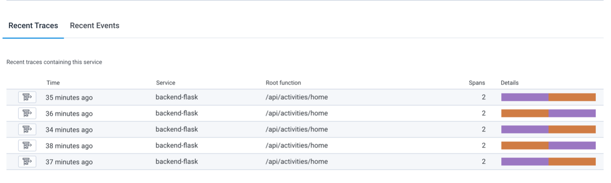
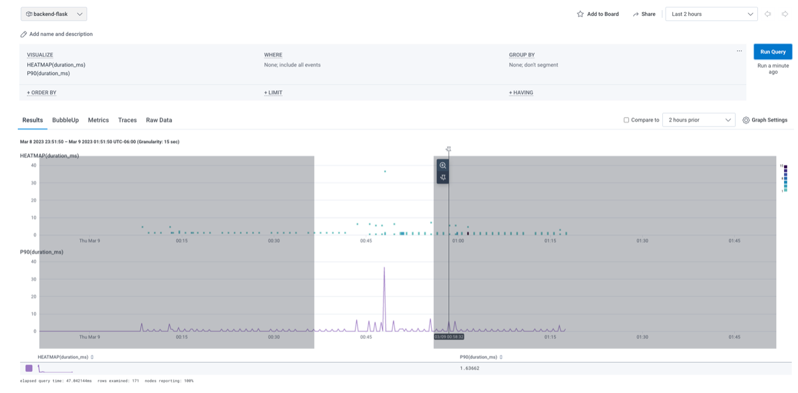
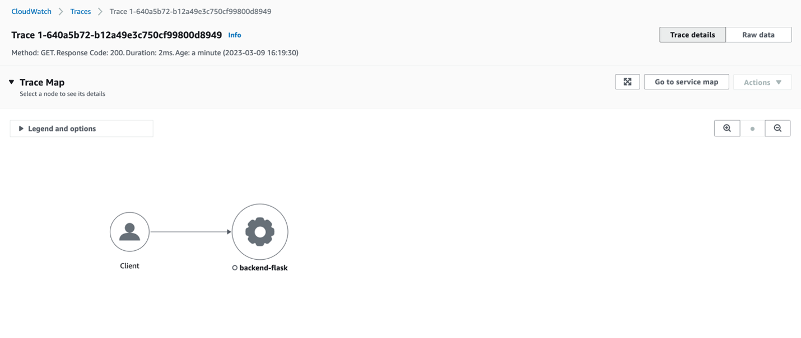
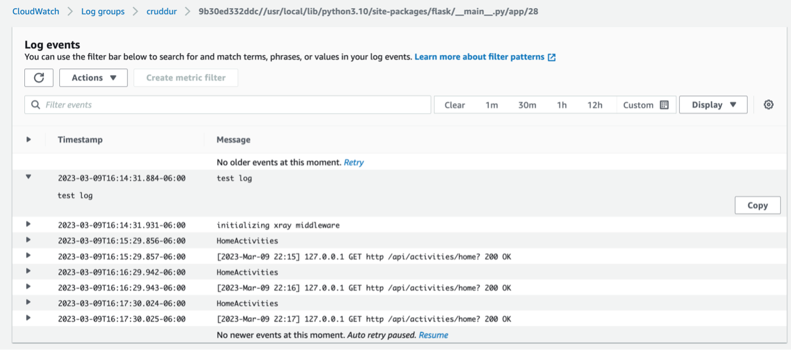

# Week 2 — Distributed Tracing

## Observability vs Monitoring 

It is all about logs!!!
* Logging & Application Workloads
* Monolithic Applications
* Microservices Applications
* Distributed services
* Traditional Logging system

Why logging is SH*T!!!
1.	Time consuming
2.	Tons of data with no context for why of the security events?
3.	Mordern applications are distributed
4.	Increase Alert fatigue for SOC Teams & Aplication Teams (SREs, DevOps etc)

Why Observability!
1.	Decreased Alert fatique for SecOps Teams
2.	Visibility of end2end of Logs, metrics & tracing
3.	Troubleshoot and resolve things quickly without costing too much money
4.	Understand application health
5.	Accelerate collaboration between teams
6.	Reduce overall operational cost
7.	Increase customer satisfaction

Monitoring is focused on collecting and analyzing metrics to track the health and performance of a system, while observability is focused on creating a holistic view of a system's behavior to understand why it is behaving a certain way.



Observability has 3 pillars:
* Metrics
* Traces
* Logs


[AWS Observability Options](https://youtu.be/or7uFFyHIX0)




### Instrumenting Honeycomb with Open Telemetry (OTEL)

#### During Jessica Kerr’s session:

Distributed Tracing is a method used in software development to understand how a request is processed in a distributed system. It involves instrumenting code to track the request's path through the system, enabling developers to identify issues like bottlenecks and errors. This helps improve system performance and reliability, and is a critical tool in modern DevOps practices. 
Honeycomb is a cloud-based observability platform that helps software engineers debug and understand their applications in real-time. It provides high-resolution tracing, profiling, and monitoring capabilities that allow developers to quickly identify and resolve performance issues, errors, and other problems in their software applications.
Honeycomb's main features include:
1.	Tracing: Honeycomb allows users to trace every request through a system in real-time, capturing all of the data about the request and the system's response.
2.	Visualization: Honeycomb provides a range of visualizations, including heatmaps, histograms, and scatter plots, that allow users to easily analyze and understand their data. We implemented this during the livestream session.
3.	Collaboration: Honeycomb allows teams to collaborate on debugging and troubleshooting by sharing data and insights across the organization.
4.	Integrations: Honeycomb integrates with a wide range of tools and platforms, including Kubernetes, AWS, and GitHub, to provide a seamless experience for developers.

#### Adding OTEL to the backend-flask


When creating a new dataset in Honeycomb it will provide all these installation insturctions


In my `requirements.txt` file, I added the following packages to instrument the app with OTEL.
```
opentelemetry-api 
opentelemetry-sdk 
opentelemetry-exporter-otlp-proto-http 
opentelemetry-instrumentation-flask 
opentelemetry-instrumentation-requests
```

Then I installed the packages:

```sh
pip install -r requirements.txt
```

In the `app.py` file, I created and initialized tracer and flask instrumentation to send data to Honeycomb.

```py
from opentelemetry import trace
from opentelemetry.instrumentation.flask import FlaskInstrumentor
from opentelemetry.instrumentation.requests import RequestsInstrumentor
from opentelemetry.exporter.otlp.proto.http.trace_exporter import OTLPSpanExporter
from opentelemetry.sdk.trace import TracerProvider
from opentelemetry.sdk.trace.export import BatchSpanProcessor
```


```py
# Initialize tracing and an exporter that can send data to Honeycomb
provider = TracerProvider()
processor = BatchSpanProcessor(OTLPSpanExporter())
provider.add_span_processor(processor)
trace.set_tracer_provider(provider)
tracer = trace.get_tracer(__name__)
```

```py
# Initialize automatic instrumentation with Flask
app = Flask(__name__)
FlaskInstrumentor().instrument_app(app)
RequestsInstrumentor().instrument()
```
Then I created spans to describe what is happening in your application. For example, this could be a HTTP handler, a long running operation, or a database fetch. Spans are created in a parent-child pattern, so each time you create a new span, the current active span is used as its parent.
```py
with tracer.start_as_current_span("home-activities-mock-data"):
      span = trace.get_current_span()
      now = datetime.now(timezone.utc).astimezone()
      span.set_attribute("app.now", now.isoformat())
```

I added the following environment variables to `backend-flask` in my docker compose file.

```yml
OTEL_EXPORTER_OTLP_ENDPOINT: "https://api.honeycomb.io"
OTEL_EXPORTER_OTLP_HEADERS: "x-honeycomb-team=${HONEYCOMB_API_KEY}"
OTEL_SERVICE_NAME: "${HONEYCOMB_SERVICE_NAME}"
```


Ran queries:




### Instrument AWS X-Ray for Flask

AWS X-Ray is a service provided by Amazon Web Services that allows you to trace requests made to your application and to gain insights into the performance of your application.

With AWS X-Ray, you can track requests as they flow through your application, identify the components and services used by your application, and analyze performance issues such as latency and errors. X-Ray provides a comprehensive view of the health of your application and can help you identify areas for optimization.

To use AWS X-Ray, you need to instrument your application by adding the X-Ray SDK to your code. The SDK provides libraries for a variety of programming languages, including Java, .NET, Node.js, Python, Ruby, and Go. The SDK generates trace data, which is sent to the X-Ray service where it is stored and analyzed. You can then use the AWS X-Ray console to visualize and analyze the trace data.

AWS X-Ray is particularly useful for applications that are built using a microservices architecture, as it allows you to trace requests as they flow through multiple services. It can also be used with other AWS services such as AWS Lambda, AWS Elastic Beanstalk, and AWS EC2 instances.


In my `requirements.txt` file, I added the following packages to instrument the app with AWS X-Ray
```py
aws-xray-sdk
```

Then I installed the packages:

```sh
pip install -r requirements.txt
```

In the `app.py` file, I added the code below to setup AWS X-Ray SDK and middleware to trace request made to the backend-flask and send trace data to the X-Ray endpoint.

```py
from aws_xray_sdk.core import xray_recorder
from aws_xray_sdk.ext.flask.middleware import XRayMiddleware

xray_url = os.getenv("AWS_XRAY_URL")
xray_recorder.configure(service='Cruddur', dynamic_naming=xray_url)
XRayMiddleware(app, xray_recorder)
```

#### Setup AWS X-Ray Resources

Added `aws/json/xray.json`

```json
{
  "SamplingRule": {
      "RuleName": "Cruddur",
      "ResourceARN": "*",
      "Priority": 9000,
      "FixedRate": 0.1,
      "ReservoirSize": 5,
      "ServiceName": "backend-flask",
      "ServiceType": "*",
      "Host": "*",
      "HTTPMethod": "*",
      "URLPath": "*",
      "Version": 1
  }
}
```

Created a group
```sh
aws xray create-group \
   --group-name "Cruddur" \
   --filter-expression "service(\"backend-flask\")
```

Created a sampling rule. Sampling rules determine which requests are traced and can help reduce the amount of trace data that is generated.
```sh
aws xray create-sampling-rule --cli-input-json file://aws/json/xray.json
```

Added Deamon Service to Docker Compose

```yml
  xray-daemon:
    image: "amazon/aws-xray-daemon"
    environment:
      AWS_ACCESS_KEY_ID: "${AWS_ACCESS_KEY_ID}"
      AWS_SECRET_ACCESS_KEY: "${AWS_SECRET_ACCESS_KEY}"
      AWS_REGION: "us-east-1"
    command:
      - "xray -o -b xray-daemon:2000"
    ports:
      - 2000:2000/udp
```

Added two env vars to the backend-flask in the `docker-compose.yml` file

```yml
      AWS_XRAY_URL: "*4567-${GITPOD_WORKSPACE_ID}.${GITPOD_WORKSPACE_CLUSTER_HOST}*"
      AWS_XRAY_DAEMON_ADDRESS: "xray-daemon:2000"
```

```
 


### Cloudwatch

In my `requirements.txt` file, I added the following packages to instrument the app with Cloudwatch
```
watchtower
```
Then I installed the packages:

```sh
pip install -r requirements.txt
```

In the `app.py` file, I added the code below to configure python logger to use Cloudwatch as the logging destination.
```
import watchtower
import logging
from time import strftime
```

```py
# Configuring Logger to Use CloudWatch
LOGGER = logging.getLogger(__name__)
LOGGER.setLevel(logging.DEBUG)
console_handler = logging.StreamHandler()
cw_handler = watchtower.CloudWatchLogHandler(log_group='cruddur')
LOGGER.addHandler(console_handler)
LOGGER.addHandler(cw_handler)
LOGGER.info("test log")
```

```py
@app.after_request
def after_request(response):
    timestamp = strftime('[%Y-%b-%d %H:%M]')
    LOGGER.error('%s %s %s %s %s %s', timestamp, request.remote_addr, request.method, request.scheme, request.full_path, response.status)
    return response
```

Logging
```py
logger.info("HomeActivities")
```

Set the env var in the backend-flask for `docker-compose.yml`

```yml
      AWS_DEFAULT_REGION: "${AWS_DEFAULT_REGION}"
      AWS_ACCESS_KEY_ID: "${AWS_ACCESS_KEY_ID}"
      AWS_SECRET_ACCESS_KEY: "${AWS_SECRET_ACCESS_KEY}"
```



 

### Rollbar
Rollbar is a cloud-based error monitoring and debugging service that helps software teams identify and fix bugs and errors in their code. It offers real-time visibility into errors, exceptions, and crashes across the entire stack, from backend servers to frontend applications. Rollbar integrates with a wide range of programming languages and platforms, including Python, Ruby, JavaScript, and PHP.

https://rollbar.com/

Created a new project in Rollbar called `Cruddur`

Added this to `requirements.txt`

```
blinker
rollbar
```

```sh
pip install -r requirements.txt
```

Set the access token

```sh
export ROLLBAR_ACCESS_TOKEN=""
gp env ROLLBAR_ACCESS_TOKEN=""
```

Added to `docker-compose.yml` backend-flask 

```yml
ROLLBAR_ACCESS_TOKEN: "${ROLLBAR_ACCESS_TOKEN}"
```

Imported for Rollbar

```py
import rollbar
import rollbar.contrib.flask
from flask import got_request_exception
```

```py
rollbar_access_token = os.getenv('ROLLBAR_ACCESS_TOKEN')
@app.before_first_request
def init_rollbar():
    """init rollbar module"""
    rollbar.init(
        # access token
        rollbar_access_token,
        # environment name
        'production',
        # server root directory, makes tracebacks prettier
        root=os.path.dirname(os.path.realpath(__file__)),
        # flask already sets up logging
        allow_logging_basic_config=False)

    # send exceptions from `app` to rollbar, using flask's signal system.
    got_request_exception.connect(rollbar.contrib.flask.report_exception, app)
```

Added an endpoint to `app.py` for testing rollbar

```py
@app.route('/rollbar/test')
def rollbar_test():
    rollbar.report_message('Hello World!', 'warning')
    return "Hello World!"
```
